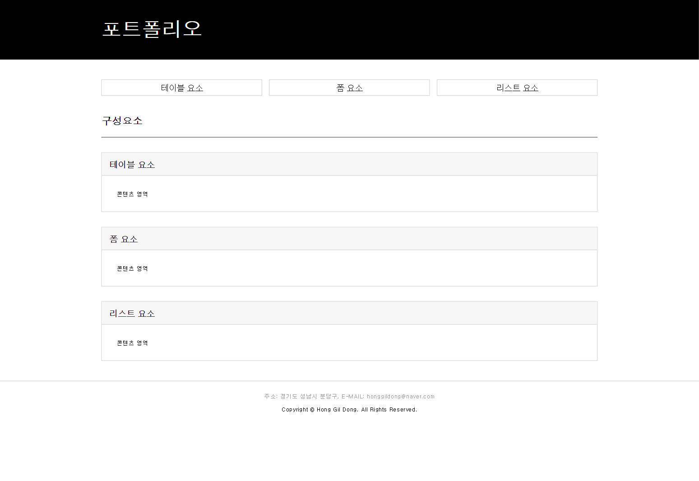
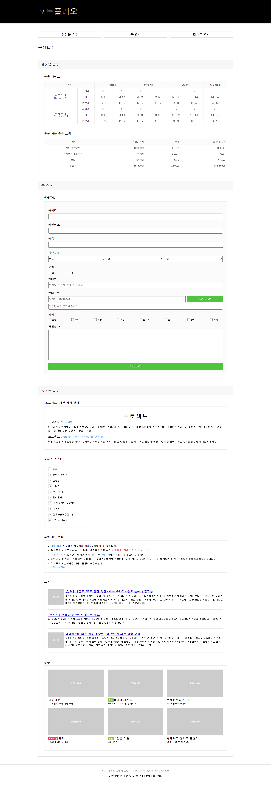
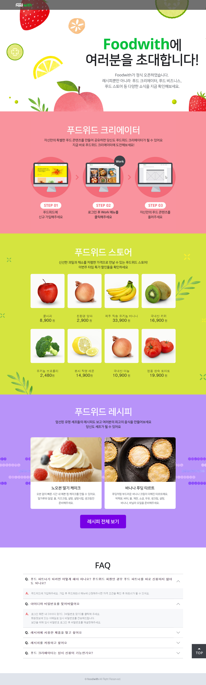
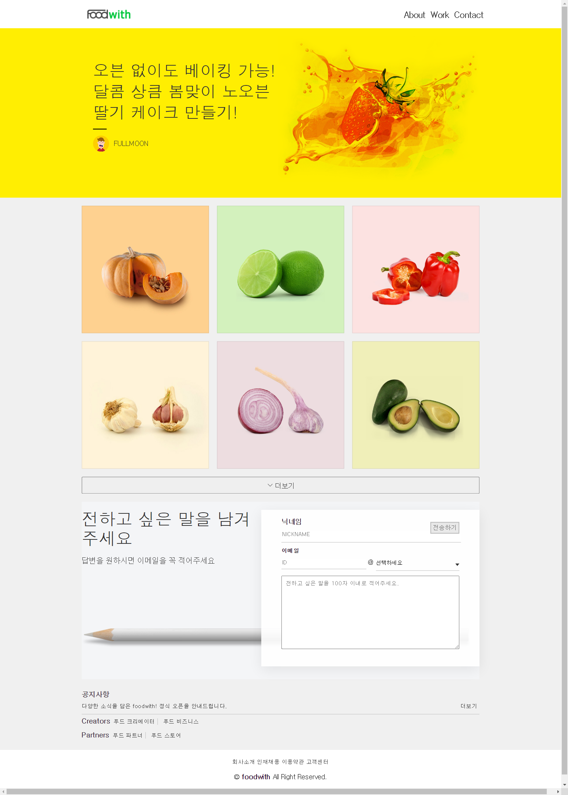
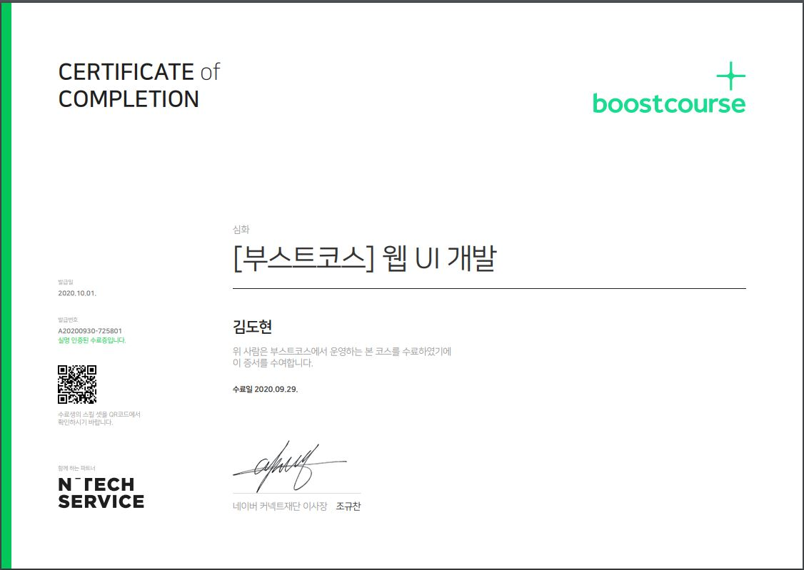

- [edwith [부스트코스] 웹 UI 개발](https://www.edwith.org/boostcourse-ui/joinLectures/20901)의 강의를 수강하고 완료한 프로젝트입니다.

- 모든 프로젝트는 디자인 가이드에 따라 작성하였고 코드 리뷰를 통과하였습니다.

- 프로젝트는 다음과 같은 사항을 고려하였습니다.

  - 시맨틱 마크업

  - 크로스 브라우징

    - E10 이상 / 크롬, 파이어폭스, 웨일 최신 버전

  - HTML 코드 유효성 검사 ([https://validator.w3.org/](https://validator.w3.org/))

  - CSS 코드 유효성 검사 ([https://jigsaw.w3.org/css-validator/](https://jigsaw.w3.org/css-validator/))

---

### Project A-1

|            Project A-1            |
| :-------------------------------: |
|  |

- [Design guide](https://drive.google.com/file/d/1c3cxAl70dJGMd6wOGkNRt4hzm8btS11p/view)

- [평가 기준표](https://www.boostcourse.org/web344/project/42/content/35#evaluation)

### Project A-2

|            Project A-2            |
| :-------------------------------: |
|  |

- [Design guide](https://drive.google.com/file/d/1z7_yU52ntXZ4ug5dFulIf43ydRlvHuWk/view)

- [평가 기준표](https://www.boostcourse.org/web344/project/156/content/128#evaluation)

### Project B

|            Project B             |
| :------------------------------: |
|  |

- [Design guide](https://drive.google.com/file/d/1BD6qPs7KGIZ5nO-8QKqG9GuTFRoKkBdp/view)

- [평가 기준표](https://www.boostcourse.org/web344/project/157/content/129#evaluation)

### Project C

|           Project C - MAIN           |           Project C - VIEW           |
| :----------------------------------: | :----------------------------------: |
|  |  |

- [Design guide](https://drive.google.com/file/d/1bBKCSkeG5T5zZdK8kOX7O0Qyhvrq2E1w/view)

- [평가 기준표](https://www.boostcourse.org/web344/project/116/content/100#evaluation)

---

### 수료증

